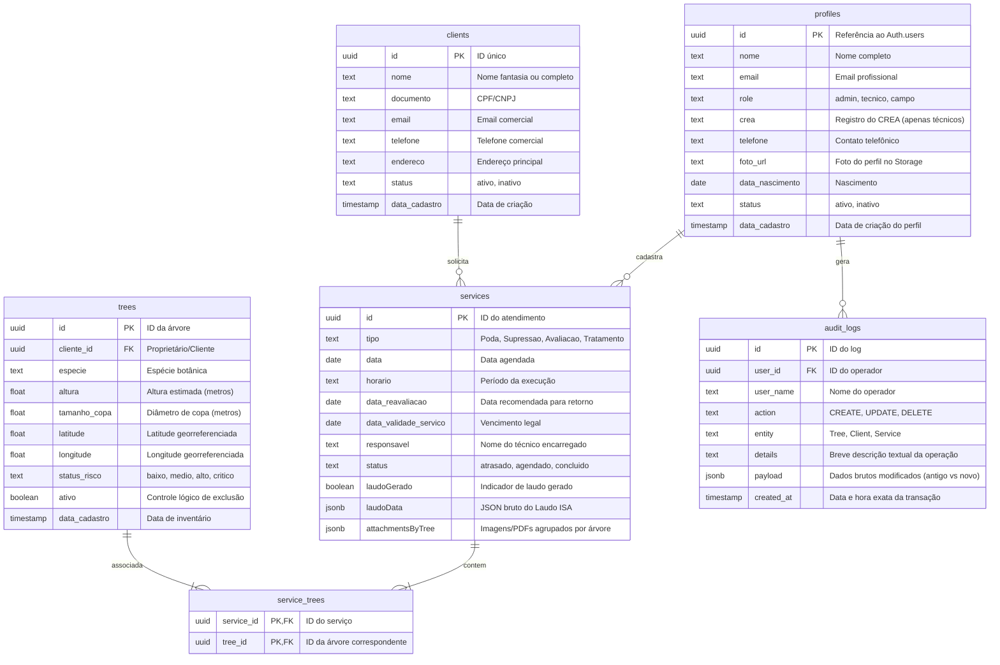

# Arbolia - Gestão de Arborização Urbana 🌳 (v1.3.1)

> **Status de Deploy:** Integração Supabase + Vercel (Produção Otimizada, Reativa e Segura)  
> **Arquitetura:** Padrão de 3 Camadas A.N.T. (Architecture, Navigation, Tools) com leis invariantes de controle e segurança.

Plataforma Web SaaS de altíssimo nível para **inventário georreferenciado, monitoramento fitossanitário em tempo real, conformidade legal, gestão de serviços de manejo arbóreo e auditoria florestal**. Projetada especificamente para engenheiros florestais, agrônomos, técnicos de campo, auditores e administradores de planejamento ambiental urbano.

---

## 🎨 Design & UX Premium (Aparência Dinâmica)
O **Arbolia** foi projetado com foco na excelência visual e fluidez ergonômica, utilizando melhores práticas de design contemporâneo:
- **Glassmorphism**: Componentes flutuantes translúcidos com bordas arredondadas, bordas finas semi-transparentes e desfoque de fundo avançado (`backdrop-blur-md` e `bg-white/70`).
- **Micro-interações Fluidas**: Feedback instantâneo sob hover e foco em elementos interativos com transições CSS suaves (tempo calibrado entre `150ms` e `300ms`).
- **Fadiga Visual Zero (Dark Mode Calibrado)**: Modo escuro com tons pretos e cinza fosco premium (`#121212` e `#1e1e1e`), eliminando luz azul excessiva e otimizando a visualização de mapas no campo sob sol forte ou à noite.
- **Logotipos Adaptativos**: O logotipo principal da barra lateral transiciona automaticamente de verde escuro florestal (`logo_arbolia.png`) em tema claro para branco puro (`logo_branca.png`) em tema escuro, mantendo o contraste de marca.
- **Rolagem e Gráficos Responsivos**: Customização estrita de scrollbars finas e visualizações otimizadas de alta fidelidade para tablets e smartphones robustecidos de uso em campo.

---

## ✨ Subsistemas e Funcionalidades Detalhadas

### 🌦️ 1. Monitoramento Climático e Matriz Composta de Segurança Operacional
- **Integração Open-Meteo**: Coleta em tempo real e previsões climáticas horárias de alta precisão para temperatura, umidade, velocidade do vento, probabilidade de chuva, volume de precipitação (mm) e velocidade de rajadas de vento.
- **Gráficos Climáticos Dinâmicos (Recharts)**: Exibição interativa e elegante das variações meteorológicas das últimas 24h, com hover funcional detalhando vento atual, rajadas, umidade relativa e chuva acumulada em milímetros.
- **Auto-complete com Geocoding e Priorização Nacional**: Campo de busca preditiva de municípios com algoritmo personalizado que **prioriza cidades do Brasil** nas primeiras posições de busca geográfica (filtrando e ordenando via JavaScript por `country_code: 'BR'`).
- **Matriz de Riscos de Manejo Operacional**: Sistema reativo que avalia as condições meteorológicas combinadas para a segurança da equipe de campo:
  - 🔴 **Condições Críticas (Alerta Vermelho)**: Rajadas de vento > **55 km/h** *OU* Probabilidade de chuva > **50%** com volume acumulado acima de **10 mm**. Ação recomendada: **Paralisação total dos serviços de campo**.
  - 🟠 **Condições Instáveis (Alerta Laranja)**: Rajadas de vento > **40 km/h** *OU* Probabilidade de chuva > **30%** com volume acumulado acima de **2 mm**. Ação recomendada: **Manejo crítico de cesto aéreo e podas de alta tensão suspensas**.
  - 🟢 **Condições Favoráveis (Alerta Verde)**: Ventos amenos e ausência de precipitação severa. Ação recomendada: **Operação em campo normalizada**.

### 🗺️ 2. Sincronização Bidirecional Mapa ↔ Lista (Sem Recarregamento)
- **Handshake de UI Reativo**: 
  - Passar o mouse (*hover*) em uma árvore na lista lateral destaca instantaneamente o marcador georreferenciado correspondente no mapa Leaflet (aumentando a escala e aplicando glow).
  - Interagir diretamente com o marcador no mapa Leaflet aplica dinamicamente uma borda verde translúcida ao item e executa um scroll suave (`scroll-into-view`) na lista lateral correspondente.
- **Mapa Leaflet Temático**:
  - Em modo claro, o mapa consome tiles padrão **CartoDB Positron** (visualização limpa de arruamento).
  - Em modo escuro, o mapa transiciona de forma fluida para a versão **CartoDB Dark Matter**, redesenhando popups, pins e botões de zoom em cores de alto contraste noturno.
- **Visualização por Risco e Multi-seleção**:
  - As árvores recebem pins coloridos no mapa baseando-se no seu status de risco calculado (verde = baixo, amarelo = médio, laranja = alto, vermelho = crítico).
  - Seleção de múltiplas árvores no mapa ou lista destrava o botão **"Gerenciar Árvores"**, habilitando agendamentos e cadastros de serviços em lote.

### 📅 3. Cronograma Inteligente e Código de Cores Funcional (LIFO)
- **Agrupamentos Temporais Dinâmicos**: A página inicial agrupa os atendimentos pendentes de acordo com a proximidade de execução:
  - 🔴 **Atrasados**: Serviços não concluídos em datas anteriores à atual.
  - 🟢 **Hoje**: Serviços estritamente agendados para a data corrente.
  - 🔵 **Amanhã**: Serviços do dia seguinte.
  - 🟡 **Esta Semana**: Visão tática para os próximos 7 dias.
  - 🟣 **Em Breve**: Planejamento estratégico acima de 7 dias.
- **Tratamento de Timezones**: Conversão robusta de fusos horários locais e parses de data no formato `YYYY-MM-DD` para evitar defasagem no calendário de campo ao transitar entre UTC e local.
- **Ordenação Nativa LIFO**: Os agendamentos são exibidos de forma cronológica reversa, mantendo as atividades mais urgentes e recentes visíveis primeiro.

### 📄 4. Emissão Automática de Laudos e Avaliação de Risco Arbóreo
- **Padrão ISA (International Society of Arboriculture - TRAQ)**: Geração profissional de laudos de risco de queda e fitossanitários baseados em diâmetro da copa, altura, espécie, condições de solo e defeitos estruturais observados.
- **Cálculo Multidimensional de Risco (Matriz ISA)**:
  1. Cruza **Probabilidade de Falha** (*Iminente, Provável, Possível, Impossível*) com **Probabilidade de Impacto** (*Alto, Médio, Baixo, Muito Baixo*) para obter o grau de **Falha e Impacto** (*Muito Provável, Provável, Mínimo, Insignificante*).
  2. Cruza o resultado de **Falha e Impacto** com as **Consequências** (*Severa, Significante, Mínima, Insignificante*) para determinar a classificação final do risco da árvore (*Extremo, Alto, Moderado, Baixo*).
- **Proposta de Mitigação & Risco Residual**: Sugere intervenções como poda de segurança, endoterapia, coroamento da base e calcula matematicamente o risco residual projetado após as ações mitigadoras.
- **Visualizador de Laudo**: Um formulário modular passo-a-passo (Etapas: Alvos, Defeitos, Matrizes, Mitigação/Parecer, Estilo) que simplifica a coleta de dados de campo em interfaces limpas de alta usabilidade.

### 📄 5. PDF Generation API & Storage Flow (jsPDF + AutoTable)
A geração de PDFs no **Arbolia** é robusta e puramente desenvolvida no client-side via código vetorial preciso (`jsPDF` + `jspdf-autotable`), garantindo a mais alta fidelidade de impressão sem depender de servidores terceiros:
- **Layout & Estilização Vetorial**:
  - **Identidade Corporativa**: Desenha o cabeçalho oficial puxando a imagem base em Base64 do logotipo corporativo, desenha divisores finos e aplica as fontes tipográficas em grid.
  - **Credenciais do Técnico**: Gera automaticamente no topo direito um badge detalhado contendo o nome e o registro profissional no **CREA** do técnico logado que executou a vistoria.
  - **Resumo Executivo**: Desenha um card colorido de risco (verde, amarelo, vermelho ou vermelho-escuro) alinhado horizontalmente a uma tabela limpa com metadados do cliente e da espécie avaliada.
  - **Matriz de Alvos (AutoTable)**: Constrói uma tabela estruturada mapeando cada Alvo avaliado (ex: rede elétrica, via pública), a parte correspondente da árvore (copa, tronco, raiz) e o risco calculado. Uma rotina de parse (`didParseCell`) colore dinamicamente a célula de risco em vermelho se atingir status crítico ou extremo.
  - **Plano de Mitigação**: Itera sobre as ações selecionadas, inserindo retângulos vetoriais que detalham a intervenção física e a queda projetada do risco (Ex: "Reduz para Baixo").
  - **Resumo IA Embutido**: Reserva uma seção especial para o parecer em linguagem simples gerado pelo Google Gemini.
  - **Rodapé de Autenticação**: Insere marcas de direitos autorais e termos de validação digital.
- **Upload para Supabase Storage (Plano A - Online)**:
  - Compila o documento em memória e extrai um objeto `Blob`: `const pdfBlob = doc.output('blob');`.
  - Envia via HTTP POST seguro ao bucket privado `Documents` do Supabase Storage no caminho `evaluations/laudo_isa_${serviceId}_${Date.now()}.pdf`.
  - Com o upload bem-sucedido, armazena o caminho de referência (`storagePath`) no banco relacional para persistência perpétua.
- **Fallback Base64 (Plano B - Offline/Instável)**:
  - Caso o usuário esteja em campo sem sinal de internet, o sistema executa um fallback transparente: converte o PDF em uma string DataURL Base64 (`doc.output('datauristring')`).
  - Grava a string diretamente na coluna `attachmentsByTree` do serviço, permitindo a sincronização do laudo local via Zustand persistente no `localStorage` do dispositivo até que a rede retorne.

### 🧠 6. Laudo Assistido por Inteligência Artificial (Google Gemini)
O **Arbolia** integra inteligência artificial nativa para aproximar os laudos biológicos complexos dos clientes finais leigos (como síndicos de condomínios, fiscais ou moradores):
- **Modelo Utilizado**: `gemini-flash-latest` (velocidade e precisão estrutural).
- **Parâmetros Técnicos Rígidos**:
  - Executa requisições POST para a API REST oficial do Gemini (`https://generativelanguage.googleapis.com/v1beta/models/gemini-flash-latest:generateContent?key=${VITE_GEMINI_API_KEY}`).
  - Ajustado com **Temperatura: 0.1** para mitigar alucinações de dados e assegurar respostas puramente baseadas no payload técnico de vistoria.
- **Payload de Entrada**:
  ```json
  {
    "especie": "Tipuana tipu",
    "defeitos": ["Rachadura no tronco", "Sinais de fungos ou podridão"],
    "risco_geral": "Alto",
    "mitigacoes_sugeridas": ["Poda de limpeza", "Coroamento da base"],
    "observacoes_tecnicas": "Rachadura longitudinal de 1.5m voltada para rede elétrica."
  }
  ```
- **Prompt do Sistema (System Instruction)**: Atua estritamente como um especialista em arboricultura urbana encarregado de traduzir a inspeção técnica de forma empática e didática. É proibido criar dados ou presunções de riscos não contidos no payload original. Jargões como "Codominância" ou "Dano no Alburno" devem ser sucintamente explicados.
- **Estrutura Determinística de Retorno (JSON Schema)**:
  Retorna estritamente um objeto JSON com duas chaves essenciais:
  1. `"resumo_estado_geral"`: Um parágrafo coeso de 4 a 5 linhas relatando a fitossanidade da árvore, os defeitos e justificando de forma leiga por que atingiu a classificação de risco calculada.
  2. `"explicacao_mitigacao"`: Um parágrafo de 3 a 4 linhas explicando as ações corretivas recomendadas e como elas reduzem efetivamente o perigo na área.
- **Sanitização da Resposta**: O serviço (`geminiService.ts`) processa o retorno e, caso a IA devolva blocos Markdown (como ` ```json `), aplica expressões regulares automáticas para limpar as marcações antes de executar o parse final para inserção nos dados estruturados do laudo.

### 🗂️ 7. Gestão do Acervo Digital Histórico e Linha do Tempo
- **Módulo de Galeria e Documentos**: Filtros instantâneos por cliente, espécie, ID ou tipo de serviço para fotos de campo e relatórios gerados.
- **Modo Antes/Depois (Before & After)**: 
  - Agrupa automaticamente os arquivos de imagens correspondentes ao mesmo `treeId` ao longo de toda a sua linha do tempo de atendimentos no banco.
  - Apresenta as fotos lado a lado, etiquetando a mais antiga como **"Antes"** e a mais recente como **"Depois"**, acompanhadas das datas de vistoria. Isso gera uma prestação de contas visual impecável do manejo florestal realizado.
- **Tags de Validade e Documentações**: Exibição de tags reativas alertando vencimentos de licenças ou laudos, calculando dinamicamente os dias restantes antes da expiração.
- **Visualizadores Integrados**: Lightbox imersivo em tela cheia para fotos de campo e painel lateral integrado com iframe seguro de alta definição para leitura instantânea de PDFs armazenados no bucket do Supabase.

### 👥 8. Perfis Técnicos e Gestão de Equipes
- **Controle de Perfis da Equipe**: Módulo administrativo contendo Nome completo, e-mail institucional, telefone de contato, data de nascimento, foto de identificação e o registro oficial do **CREA** (para engenheiros e técnicos de campo).
- **Controle de Acesso Dinâmico (Roles)**:
  - `admin`: Controle total, gerenciamento de equipe (cadastro/edição/status), exclusão de serviços, visualização de auditoria e auditorias gerais.
  - `tecnico`: Cadastros e edições no inventário de árvores, agendamento e conclusão de atendimentos, geração de laudos técnicos ISA e análise de risco.
  - `campo`: Acesso móvel a checklists de vistoria, preenchimento de fotos e registros de conclusão de podas.
- **Toggle de Status (Ativo/Inativo)**: Suspensão imediata de acessos de colaboradores direto no painel, alterando dinamicamente o status no banco de dados.

### 📈 9. Log de Atendimentos, Filtros e Auditoria Completa
- **Auditoria Transacional no PostgreSQL (Audit Logs)**:
  - Todas as operações críticas no banco de dados (`CREATE`, `UPDATE`, `DELETE`) de Árvores, Clientes e Serviços disparam o registro de auditoria na tabela `audit_logs`.
  - Salva os metadados do operador (UUID e Nome), a ação efetuada, descrição, timestamp e um payload complexo em formato `JSONB` contendo as diferenças exatas entre o estado antigo e o novo.
  - **Segurança Estrita via RLS**: Políticas de segurança de nível de linha no Supabase asseguram que **apenas usuários administradores (`profiles.role = 'admin'`)** consigam visualizar os logs de auditoria técnica.
- **Motor de Exportação**:
  - **Relatório PDF**: Tabela consolidada com estatísticas mensais formatadas para impressão.
  - **CSV Estruturado**: Planilha de dados delimitados por ponto e vírgula contendo todos os registros de atendimentos para integração com softwares de BI (como PowerBI e Metabase).

### ⚙️ 10. Painel de Preferências e Central de Notificações
- **Preferências Customizáveis**: Ajustes manuais de intervalos de atualização do clima (5 a 60 min), chaves de alarmes meteorológicos e escalas (Celsius/Fahrenheit, km/h ou m/s) integrados ao Zustand e salvos no banco.
- **Central de Notificações Persistente**: Notifica reativamente sobre serviços atrasados, alertas severos do dia e recomendações da matriz operacionais. Alertas apagados ou marcados como lidos persistem no `localStorage` do dispositivo móvel para evitar chamadas redundantes.

---

## 🛠️ Stack Tecnológica e Bibliotecas

| Categoria | Tecnologia / Biblioteca | Finalidade |
|---|---|---|
| **Core** | `React 19` + `TypeScript 6` | SPA reativa ultrarápida com tipagem de dados estrita. |
| **Backend / BD** | `Supabase (PostgreSQL)` | Autenticação JWT, Storage privado/público, Auditoria SQL e RLS. |
| **Bundler** | `Vite 8` | Compilação otimizada, Hot Module Replacement instantâneo. |
| **Estilização** | `Tailwind CSS 4` | Estilização utilitária de alta fidelidade, suporte a Glassmorphism e Dark Mode nativos. |
| **Estado Global** | `Zustand 5` | Gerenciamento leve do estado global reativo com persistência em cache local. |
| **Mapas** | `Leaflet 1.9` + `React Leaflet 5` | Renderização de mapas dinâmicos e controle interativo de camadas de Tiles. |
| **Gráficos** | `Recharts 3.8` | Construção de dashboards climatológicos em linhas e barras interativas. |
| **Exportações** | `jsPDF` + `jsPDF-AutoTable` | Programação de PDFs vetoriais avançados e exportações diretas. |
| **Offline / PWA** | `vite-plugin-pwa` | Suporte offline total e instalação no desktop/mobile via Service Workers. |

---

## 🗃️ Modelagem Relacional do Banco de Dados (Supabase / PostgreSQL)

A base de dados do **Arbolia** é estruturada relacionalmente com chaves estrangeiras rígidas, índices de busca rápida e políticas rígidas de **RLS (Row Level Security)**.



---

## 🔌 APIs Externas Consumidas

1. **API de Previsão do Clima (Open-Meteo)**
   - **Endpoint**: `https://api.open-meteo.com/v1/forecast`
   - **Parâmetros utilizados**: `latitude`, `longitude`, `hourly=temperature_2m,relative_humidity_2m,precipitation,rain,wind_speed_10m,wind_gusts_10m,wind_direction_10m`, `timezone=auto`.
   - **Licença**: Uso gratuito para fins de planejamento e geolocalização.

2. **API de Geocodificação (Geocoding - Open-Meteo)**
   - **Endpoint**: `https://geocoding-api.open-meteo.com/v1/search`
   - **Finalidade**: Busca e autocomplete geográfico de municípios, com reordenação de relevância no cliente para dar preferência a localizações brasileiras (`country_code: 'BR'`).

3. **Google Gemini REST API**
   - **Endpoint**: `https://generativelanguage.googleapis.com/v1beta/models/gemini-flash-latest:generateContent`
   - **Finalidade**: Leitura e interpretação de inspeções de risco da metodologia ISA, transformando terminologias densas em descrições acessíveis para leigos sob uma formatação estruturada de retorno.

4. **Supabase REST & Storage API**
   - **Conectividade**: Comunicação com o PostgreSQL em tempo real protegida por tokens de sessão. Realiza uploads e downloads nos buckets:
     - `profiles`: Imagens de perfis da equipe.
     - `Gallery`: Acervo de imagens de árvores e inspeções fitossanitárias.
     - `Documents`: Bucket restrito para laudos e documentações jurídicas em PDF.

---

## 📁 Estrutura de Diretórios Organizacional

O projeto está estruturado de acordo com o padrão moderno de arquitetura de software, com total separação de camadas técnicas:

```
arbolia/
├── app/                        # SPA React (Vite)
│   ├── public/                 # Recursos estáticos e manifesto do PWA (Service Workers)
│   ├── src/                    # Código-fonte da aplicação React
│   │   ├── assets/             # Logos oficiais adaptativas e imagens estruturais
│   │   ├── components/         # Componentes estruturados por funcionalidade (Modais e Forms)
│   │   │   ├── alerts/         # Modais de lembretes e avisos
│   │   │   ├── clients/        # Formulários e modais de visualização de clientes
│   │   │   ├── common/         # Componentes globais reutilizáveis (Lightbox, Imagens e Modais)
│   │   │   ├── inventory/      # Mapa interativo Leaflet, listagem de árvores e formulários ISA
│   │   │   └── layout/         # Cabeçalho, barra lateral responsiva e modais de preferências
│   │   ├── lib/                # Configurações do Supabase, utilitários e motor de cálculo ISA Risk
│   │   ├── pages/              # Páginas conectadas ao sistema de rotas (Acervo, Equipe, Clientes, Home)
│   │   ├── services/           # Camada isolada de comunicação com APIs (Open-Meteo, Gemini)
│   │   └── store/              # Central de estado global (Zustand com persistência local)
│   └── package.json, tsconfig  # Gerenciadores de dependências e tipagem estrita
├── architecture/               # POPs (Procedimentos Operacionais Padrão) em Markdown
├── database/                   # Arquivos históricos e migrações do Banco de Dados
│   └── migrations/             # Migrações SQL ordenadas cronologicamente
│       ├── 001_create_audit_logs.sql
│       └── 002_add_payload_to_audit_logs.sql
├── docs/                       # Documentações oficiais de requisitos e casos de uso
│   └── Especificação de Requisitos.docx
├── tools/                      # Scripts atômicos de teste e validação de conexões (Python)
├── gemini.md                   # Constituição do Projeto (Invariantes e leis imutáveis)
└── README.md                   # Documentação corporativa da plataforma (esta folha)
```

---

## 🚀 Como Rodar Localmente

### Pré-requisitos
- **Node.js**: `v20` ou superior.
- **npm** ou **yarn**.

### Passo a Passo de Execução

1. **Clone o repositório:**
   ```bash
   git clone https://github.com/rafaelcaetite/Arbolia.git
   cd Arbolia
   ```

2. **Configure as Variáveis de Ambiente:**
   Na pasta `/app/`, crie um arquivo `.env` baseado no `.env.example` preenchendo com as credenciais do seu banco de dados Supabase e Gemini:
   ```env
   VITE_SUPABASE_URL=https://seu-subdominio.supabase.co
   VITE_SUPABASE_ANON_KEY=sua-anon-key-jwt-gerada
   VITE_GEMINI_API_KEY=sua-chave-api-gemini
   ```

3. **Instale as dependências da aplicação:**
   ```bash
   cd app
   npm install
   ```

4. **Inicie o Servidor de Desenvolvimento:**
   ```bash
   npm run dev
   ```
   A aplicação estará rodando localmente no endereço: `http://localhost:5173`.

5. **Gerar Build de Produção (Otimizado):**
   ```bash
   npm run build
   ```
   Os arquivos finais minificados e compactados serão gerados no diretório `app/dist/` prontos para deploy na Vercel ou Netlify.

---

## 🛡️ Segurança e Práticas Recomendadas

- **Proteção de Segredos**: Nunca comite o arquivo `.env` para o Git. Ele já está devidamente cadastrado no `.gitignore`.
- **Autenticação Segura**: O acesso ao banco do Supabase está protegido por políticas de RLS. Certifique-se de que os papéis de usuários em `profiles.role` correspondam estritamente aos cargos válidos.
- **Auditoria de Alterações**: Toda operação crítica passa obrigatoriamente pela tabela de `audit_logs` registrando as modificações para conformidade técnica.
- **Verificação Dinâmica**: Antes de qualquer deploy, certifique-se de executar `npm run build` para garantir que o compilador do TypeScript e as diretrizes do Vite estejam 100% livres de falhas.

---
*Desenvolvido com rigor técnico de engenharia de software, interfaces robustas e micro-interações fluidas. 🌳🚀*
