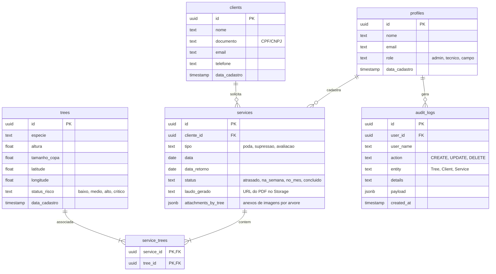

# Arbolia - Gestão de Arborização Urbana 🌳 (v1.3.0)

> **Status de Deploy:** Integração Supabase + Vercel (Produção Otimizada, Reativa e Segura)  
> **Arquitetura:** Padrão de 3 Camadas A.N.T. com protocolo de desenvolvimento V.L.A.E.G.

Plataforma Web SaaS de altíssimo nível para **inventário georreferenciado, monitoramento em tempo real, conformidade legal e gestão de serviços de manejo arbóreo**. Projetada especificamente para engenheiros florestais, agrônomos, técnicos de campo e administradores de planejamento ambiental.

---

## 🎨 Design & UX Premium (Aparência Dinâmica)
O **Arbolia** foi construído com foco na excelência visual e fluidez, utilizando melhores práticas de design contemporâneo:
- **Glassmorphism**: Componentes flutuantes translúcidos com bordas arredondadas e desfoque de fundo (*backdrop-blur*).
- **Micro-interações**: Feedback instantâneo sob hover/foco e transições suaves de 150ms a 300ms.
- **Fadiga Visual Zero (Dark Mode Calibrado)**: Modo escuro com tons pretos e cinza fosco premium (`#121212` e `#1e1e1e`), evitando luz azul excessiva.
- **Logotipos Adaptativos**: O logotipo principal da barra lateral muda automaticamente de verde escuro (`logo_arbolia.png`) para branco puro (`logo_branca.png`) de acordo com o tema selecionado.

---

## ✨ Subsistemas e Funcionalidades Detalhadas

### 🌦️ 1. Monitoramento Climático e Matriz Composta de Segurança Operacional
- **Integração Open-Meteo**: Coleta previsões horárias e em tempo real para temperatura, umidade, vento atual, probabilidade de chuva, volume de precipitação (mm) e velocidade de rajadas de vento.
- **Auto-complete com Geocoding e Priorização Nacional**: Campo de busca preditiva de municípios com algoritmo personalizado que **prioriza cidades do Brasil** nas primeiras posições de busca geográfica.
- **Matriz de Riscos de Manejo Operacional**: Sistema reativo que avalia as condições meteorológicas combinadas para a segurança da equipe de campo:
  - 🔴 **Condições Críticas (Alerta Vermelho)**: Rajadas de vento > **55 km/h** *OU* Probabilidade de chuva > **50%** com volume acumulado acima de **10 mm**. Ação recomendada: **Paralisação total dos serviços de campo**.
  - 🟠 **Condições Instáveis (Alerta Laranja)**: Rajadas de vento > **40 km/h** *OU* Probabilidade de chuva > **30%** com volume acumulado acima de **2 mm**. Ação recomendada: **Manejo crítico de cesto aéreo e podas de alta tensão suspensas**.
  - 🟢 **Condições Favoráveis (Alerta Verde)**: Ventos amenos e ausência de precipitação severa. Ação recomendada: **Operação em campo normalizada**.

### 🗺️ 2. Sincronização Bidirecional Mapa ↔ Lista (Sem Recarregamento)
- **Handshake de UI Reativo**: 
  - Passar o mouse (*hover*) em uma árvore na lista lateral destaca instantaneamente o marcador georreferenciado correspondente no mapa Leaflet.
  - Interagir diretamente com o marcador no mapa Leaflet aplica dinamicamente uma borda verde translúcida e rola o item da lista correspondente até a visualização.
- **Mapa Leaflet Temático**:
  - Em modo claro, o mapa consome tiles padrão CartoDB Positron.
  - Em modo escuro, o mapa transiciona de forma fluida para a versão **CartoDB Dark Matter**, redesenhando popups, pins e botões de zoom em cores de alto contraste noturno.

### 📅 3. Cronograma Inteligente e Código de Cores Funcional (LIFO)
- **Agrupamentos Temporais Dinâmicos**: A página inicial agrupa os atendimentos pendentes de acordo com a proximidade de execução:
  - 🔴 **Atrasados**: Serviços não concluídos em datas anteriores à atual.
  - 🟢 **Hoje**: Serviços estritamente agendados para a data corrente.
  - 🔵 **Amanhã**: Serviços do dia seguinte.
  - 🟡 **Esta Semana**: Visão tática para os próximos 7 dias.
  - 🟣 **Em Breve**: Planejamento estratégico acima de 7 dias.
- **Tratamento de Timezones**: Conversão robusta de fusos horários locais e parses de data no formato `YYYY-MM-DD` para evitar defasagem no calendário de campo.

### 📄 4. Emissão Automática de Laudos e Avaliação de Risco Arbóreo (SaaS Ready)
- **Padrão ISA (International Society of Arboriculture)**: Geração profissional de laudos de risco de queda e fitossanitário baseados em diâmetro da copa, altura, espécie, condições de solo e fitossanidade.
- **PDF Client-Side Avançado**: Renderiza dinamicamente a folha do laudo em memória RAM com `html2pdf.js`, realizando upload direto do `Blob` para o bucket do Supabase Storage. A URL gerada é persistida na coluna `documentos_url` da tabela `services`.
- **Templates Visuais Customizáveis**: Opção de três estilos de laudos para exportação:
  - **Técnico**: Layout detalhado focado em dados científicos e biométricos.
  - **Minimalista**: Clean, focado em tom cinza escuro de alta legibilidade.
  - **Executivo**: Cabeçalhos formais de alto padrão para prefeituras e grandes corporações.

### ⚙️ 5. Painel de Configurações do Usuário e Central de Notificações
- **Preferências Pessoais**: Salvamento de preferências de unidades métricas (celsius vs. fahrenheit, km/h vs. m/s) e chaves de alertas meteorológicos que sincronizam com a tabela `profiles`.
- **Central de Alertas Persistente**: Notificações reativas que alertam sobre serviços atrasados ou temporais severos. As notificações marcadas como lidas ou excluídas persistem localmente via `localStorage`.

---

## 🛠️ Stack Tecnológica e Bibliotecas

| Categoria | Tecnologia / Biblioteca | Finalidade |
|---|---|---|
| **Core** | `React 19` + `TypeScript 6` | Componentização moderna e segurança de dados estritamente tipados. |
| **Backend / BD** | `Supabase (PostgreSQL)` | Autenticação JWT, banco relacional transacional, Storage e RLS. |
| **Bundler** | `Vite 8` | Bundler ultra-rápido para desenvolvimento local e otimização de build. |
| **Estilização** | `Tailwind CSS 4` | Design Responsivo, Glassmorphism e animações otimizadas. |
| **Estado Global** | `Zustand 5` | Estado reativo leve com sincronização local (`persist` middleware). |
| **Mapas** | `Leaflet 1.9` + `React Leaflet 5` | Exibição de pins georreferenciados dinâmicos e controle de Tiles. |
| **Gráficos** | `Recharts 3.8` | Exibição de previsões climáticas interativas em barras/linhas. |
| **Exportações** | `html2pdf.js` + `jspdf` | Geração instantânea de PDFs e exportação de CSVs estruturados. |
| **Offline / PWA** | `vite-plugin-pwa` | Suporte offline total no Windows/Android/iOS via Service Workers. |

---

## 🗃️ Modelagem Relacional do Banco de Dados (Supabase / PostgreSQL)

A base de dados é altamente normalizada e protegida por regras rígidas de **RLS (Row Level Security)** que determinam o acesso de acordo com o cargo (`role`) do usuário logado (`admin`, `tecnico`, `campo`).



---

## 🔌 APIs Externas Consumidas

1. **API de Previsão do Clima (Open-Meteo)**
   - **Endpoint**: `https://api.open-meteo.com/v1/forecast`
   - **Parâmetros utilizados**: `latitude`, `longitude`, `hourly=temperature_2m,relative_humidity_2m,precipitation,rain,wind_speed_10m,wind_gusts_10m,wind_direction_10m`, `timezone=auto`.
   - **Licença**: Uso gratuito para fins não comerciais (livre de chaves de acesso).

2. **API de Geocodificação (Geocoding - Open-Meteo)**
   - **Endpoint**: `https://geocoding-api.open-meteo.com/v1/search`
   - **Finalidade**: Busca inteligente de coordenadas geográficas baseada na string digitada no autocomplete climáticos. Priorização via Javascript ordenando resultados com `country_code: 'BR'` nas primeiras posições do JSON de retorno.

3. **Supabase REST & Storage API**
   - **Conectividade**: Client JS integrado com segurança baseada no token JWT do usuário autenticado. Realiza operações CRUD atômicas e uploads no bucket `laudos-risco`.

---

## 📁 Estrutura de Diretórios Organizacional

O projeto está estruturado de acordo com o padrão moderno de arquitetura de software, com total separação de camadas técnicas:

```
arbolia/
├── app/                        # SPA React (Vite)
│   ├── public/                 # Recursos estáticos e manifesto do PWA (Service Workers)
│   ├── src/                    # Código-fonte da aplicação React
│   │   ├── assets/             # Logos oficiais adaptativas e imagens estruturais
│   │   ├── components/         # Componentes estruturados por funcionalidade (Modais e Forms)
│   │   ├── lib/                # Configurações do Supabase e motor de cálculo ISA Risk
│   │   ├── pages/              # Páginas conectadas ao sistema de rotas (/inventario, /clientes)
│   │   ├── services/           # Camada isolada de comunicação com APIs
│   │   └── store/              # Central de estado global (Zustand com persistência)
│   └── package.json, tsconfig  # Gerenciadores de dependências e tipagem estrita
├── architecture/               # POPs (Procedimentos Operacionais Padrão) em Markdown
├── database/                   # Arquivos históricos e migrações do Banco de Dados
│   └── migrations/             # Migrações SQL ordenadas cronologicamente
│       ├── 001_create_audit_logs.sql
│       └── 002_add_payload_to_audit_logs.sql
├── docs/                       # Documentações oficiais de requisitos e casos de uso
│   └── Especificação de Requisitos.docx
├── tools/                      # Scripts atômicos de teste e validação de conexões (Python)
├── gemini.md                   # Constituição do Projeto (Invariantes e leis imutáveis)
└── README.md                   # Documentação corporativa da plataforma (esta folha)
```

---

## 🚀 Como Rodar Localmente

### Pré-requisitos
- **Node.js**: `v20` ou superior.
- **npm** ou **yarn**.

### Passo a Passo de Execução

1. **Clone o repositório:**
   ```bash
   git clone https://github.com/rafaelcaetite/Arbolia.git
   cd Arbolia
   ```

2. **Configure as Variáveis de Ambiente:**
   Na pasta `/app/`, crie um arquivo `.env` baseado no `.env.example` preenchendo com as credenciais do seu banco de dados Supabase:
   ```env
   VITE_SUPABASE_URL=https://seu-subdominio.supabase.co
   VITE_SUPABASE_ANON_KEY=sua-anon-key-jwt-gerada
   ```

3. **Instale as dependências da aplicação:**
   ```bash
   cd app
   npm install
   ```

4. **Inicie o Servidor de Desenvolvimento:**
   ```bash
   npm run dev
   ```
   A aplicação estará rodando localmente no endereço: `http://localhost:5173`.

5. **Gerar Build de Produção (Otimizado):**
   ```bash
   npm run build
   ```
   Os arquivos finais minificados e compactados serão gerados no diretório `app/dist/` prontos para deploy na Vercel ou Netlify.

---

## 🛡️ Segurança e Práticas Recomendadas

- **Proteção de Segredos**: Nunca comite o arquivo `.env` para o Git. Ele já está devidamente cadastrado no `.gitignore`.
- **Autenticação Segura**: O acesso ao banco do Supabase está protegido por políticas de RLS. Certifique-se de que os papéis de usuários em `profiles.role` correspondam estritamente aos cargos válidos.
- **Verificação Dinâmica**: Antes de qualquer deploy, certifique-se de executar `npm run build` para garantir que o compilador do TypeScript e as diretrizes do Vite estejam 100% livres de falhas.

---
*Desenvolvido com rigor técnico de engenharia de software, interfaces robustas e micro-interações fluidas. 🌳🚀*
